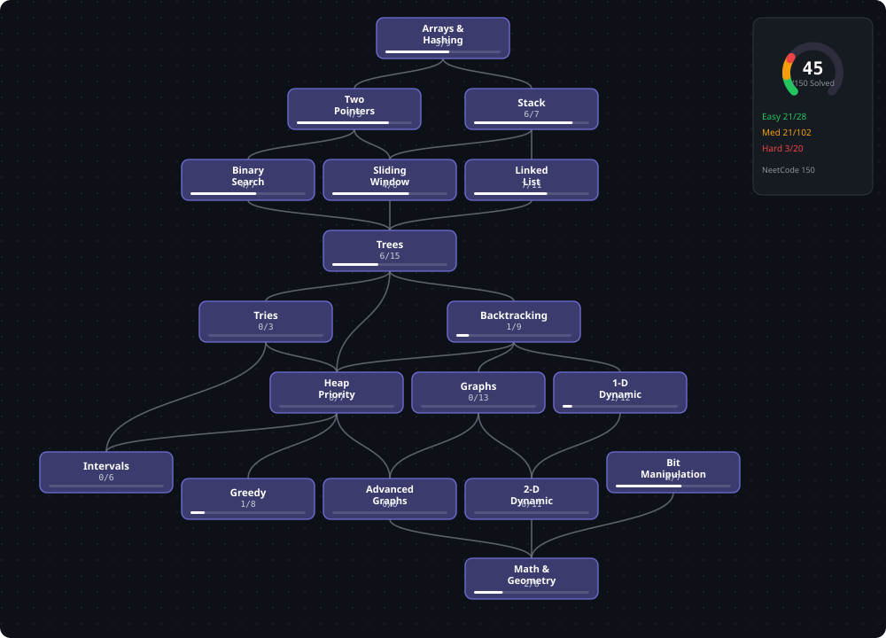

# NeetCode 150 — Tracker (single source: `src/**/*.java`)

**Progress: 47/150** — match by numeric ID only. Title/slug mismatch ignored.

| # | Category | Done | Bar |
|---|----------|------|-----|
| 1 | Arrays & Hashing | 5/9 | `██████░░░░` |
| 2 | Two Pointers | 4/5 | `████████░░` |
| 3 | Stack | 6/7 | `█████████░` |
| 4 | Sliding Window | 4/6 | `███████░░░` |
| 5 | Binary Search | 6/7 | `█████████░` |
| 6 | Linked List | 7/11 | `██████░░░░` |
| 7 | Trees | 6/15 | `████░░░░░░` |
| 8 | Trie | 0/3 | `░░░░░░░░░░` |
| 9 | Heap / Priority Queue | 0/7 | `░░░░░░░░░░` |
| 10 | Backtracking | 1/9 | `█░░░░░░░░░` |
| 11 | Graphs | 0/13 | `░░░░░░░░░░` |
| 12 | Advanced Graphs | 0/6 | `░░░░░░░░░░` |
| 13 | 1-D DP | 1/12 | `█░░░░░░░░░` |
| 14 | 2-D DP | 0/11 | `░░░░░░░░░░` |
| 15 | Greedy | 1/8 | `█░░░░░░░░░` |
| 16 | Intervals | 0/6 | `░░░░░░░░░░` |
| 17 | Math & Geometry | 2/8 | `██░░░░░░░░` |
| 18 | Bit Manipulation | 4/7 | `██████░░░░` |

## Next up (foundation first)
- [ ] 238 [Product of Array Except Self](https://leetcode.com/problems/product-of-array-except-self/) *(Arrays & Hashing)*
- [ ] 36 [Valid Sudoku](https://leetcode.com/problems/valid-sudoku/) *(Arrays & Hashing)*
- [ ] 128 [Longest Consecutive Sequence](https://leetcode.com/problems/longest-consecutive-sequence/) *(Arrays & Hashing)*
- [ ] 42 [Trapping Rain Water](https://leetcode.com/problems/trapping-rain-water/) *(Two Pointers)*
- [ ] 84 [Largest Rectangle in Histogram](https://leetcode.com/problems/largest-rectangle-in-histogram/) *(Stack)*
- [ ] 76 [Minimum Window Substring](https://leetcode.com/problems/minimum-window-substring/) *(Sliding Window)*
- [ ] 239 [Sliding Window Maximum](https://leetcode.com/problems/sliding-window-maximum/) *(Sliding Window)*
- [ ] 981 [Time Based Key-Value Store](https://leetcode.com/problems/time-based-key-value-store/) *(Binary Search)*
- [ ] 143 [Reorder List](https://leetcode.com/problems/reorder-list/) *(Linked List)*
- [ ] 138 [Copy List with Random Pointer](https://leetcode.com/problems/copy-list-with-random-pointer/) *(Linked List)*
- [ ] 287 [Find the Duplicate Number](https://leetcode.com/problems/find-the-duplicate-number/) *(Linked List)*
- [ ] 146 [LRU Cache](https://leetcode.com/problems/lru-cache/) *(Linked List)*
- [ ] 235 [Lowest Common Ancestor of a BST](https://leetcode.com/problems/lowest-common-ancestor-of-a-binary-search-tree/) *(Trees)*
- [ ] 102 [Binary Tree Level Order Traversal](https://leetcode.com/problems/binary-tree-level-order-traversal/) *(Trees)*
- [ ] 199 [Binary Tree Right Side View](https://leetcode.com/problems/binary-tree-right-side-view/) *(Trees)*

<b>Arrays & Hashing</b> — 5/9

| | # | Problem | Diff | File / Link |
|---|----|---------|------|-------------|
| ✅ | 217 | [Contains Duplicate](src/easy/%5B217%5DContains%20Duplicate.java) | Easy | `contains-duplicate` |
| ✅ | 242 | [Valid Anagram](src/easy/%5B242%5DValid%20Anagram.java) | Easy | `valid-anagram` |
| ✅ | 1 | [Two Sum](src/easy/%5B1%5DTwo%20Sum.java) | Easy | `two-sum` |
| ✅ | 49 | [Group Anagrams](src/medium/%5B49%5DGroup%20Anagrams.java) | Medium | `group-anagrams` |
| ✅ | 347 | [Top K Frequent Elements](src/medium/%5B347%5DTop%20K%20Frequent%20Elements.java) | Medium | `top-k-frequent-elements` |
| ⬜ | 238 | [Product of Array Except Self](https://leetcode.com/problems/product-of-array-except-self/) | Medium | `product-of-array-except-self` |
| ⬜ | 36 | [Valid Sudoku](https://leetcode.com/problems/valid-sudoku/) | Medium | `valid-sudoku` |
| ⬜ | 271 | [Encode and Decode Strings](https://leetcode.com/problems/encode-and-decode-strings/) | Medium | 🔒 `encode-and-decode-strings` |
| ⬜ | 128 | [Longest Consecutive Sequence](https://leetcode.com/problems/longest-consecutive-sequence/) | Medium | `longest-consecutive-sequence` |

<b>Two Pointers</b> — 4/5

| | # | Problem | Diff | File / Link |
|---|----|---------|------|-------------|
| ✅ | 125 | [Valid Palindrome](src/easy/%5B125%5DValid%20Palindrome.java) | Easy | `valid-palindrome` |
| ✅ | 167 | [Two Sum II - Input Array Is Sorted](src/medium/%5B167%5DTwo%20Sum%20II%20-%20Input%20Array%20Is%20Sorted.java) | Medium | `two-sum-ii-input-array-is-sorted` |
| ✅ | 15 | [3Sum](src/medium/%5B15%5D3Sum.java) | Medium | `3sum` |
| ✅ | 11 | [Container With Most Water](src/medium/%5B11%5DContainer%20With%20Most%20Water.java) | Medium | `container-with-most-water` |
| ⬜ | 42 | [Trapping Rain Water](https://leetcode.com/problems/trapping-rain-water/) | Hard | `trapping-rain-water` |

<b>Stack</b> — 6/7

| | # | Problem | Diff | File / Link |
|---|----|---------|------|-------------|
| ✅ | 20 | [Valid Parentheses](src/easy/%5B20%5DValid%20Parentheses.java) | Easy | `valid-parentheses` |
| ✅ | 155 | [Min Stack](src/medium/%5B155%5DMin%20Stack.java) | Medium | `min-stack` |
| ✅ | 150 | [Evaluate Reverse Polish Notation](src/medium/%5B150%5DEvaluate%20Reverse%20Polish%20Notation.java) | Medium | `evaluate-reverse-polish-notation` |
| ✅ | 22 | [Generate Parentheses](src/medium/%5B22%5DGenerate%20Parentheses.java) | Medium | `generate-parentheses` |
| ✅ | 739 | [Daily Temperatures](src/medium/%5B739%5DDaily%20Temperatures.java) | Medium | `daily-temperatures` |
| ✅ | 853 | [Car Fleet](src/medium/%5B853%5DCar%20Fleet.java) | Medium | `car-fleet` |
| ⬜ | 84 | [Largest Rectangle in Histogram](https://leetcode.com/problems/largest-rectangle-in-histogram/) | Hard | `largest-rectangle-in-histogram` |

<b>Sliding Window</b> — 4/6

| | # | Problem | Diff | File / Link |
|---|----|---------|------|-------------|
| ✅ | 121 | [Best Time to Buy and Sell Stock](src/easy/%5B121%5DBest%20Time%20to%20Buy%20and%20Sell%20Stock.java) | Easy | `best-time-to-buy-and-sell-stock` |
| ✅ | 3 | [Longest Substring Without Repeating Characters](src/medium/%5B3%5DLongest%20Substring%20Without%20Repeating%20Characters.java) | Medium | `longest-substring-without-repeating-characters` |
| ✅ | 424 | [Longest Repeating Character Replacement](src/medium/%5B424%5DLongest%20Repeating%20Character%20Replacement.java) | Medium | `longest-repeating-character-replacement` |
| ✅ | 567 | [Permutation in String](src/medium/%5B567%5DPermutation%20in%20String.java) | Medium | `permutation-in-string` |
| ⬜ | 76 | [Minimum Window Substring](https://leetcode.com/problems/minimum-window-substring/) | Hard | `minimum-window-substring` |
| ⬜ | 239 | [Sliding Window Maximum](https://leetcode.com/problems/sliding-window-maximum/) | Hard | `sliding-window-maximum` |

<b>Binary Search</b> — 6/7

| | # | Problem | Diff | File / Link |
|---|----|---------|------|-------------|
| ✅ | 704 | [Binary Search](src/easy/%5B704%5DBinary%20Search.java) | Easy | `binary-search` |
| ✅ | 74 | [Search a 2D Matrix](src/medium/%5B74%5DSearch%20a%202D%20Matrix.java) | Medium | `search-a-2d-matrix` |
| ✅ | 875 | [Koko Eating Bananas](src/medium/%5B875%5DKoko%20Eating%20Bananas.java) | Medium | `koko-eating-bananas` |
| ✅ | 153 | [Find Minimum in Rotated Sorted Array](src/medium/%5B153%5DFind%20Minimum%20in%20Rotated%20Sorted%20Array.java) | Medium | `find-minimum-in-rotated-sorted-array` |
| ✅ | 33 | [Search in Rotated Sorted Array](src/medium/%5B33%5DSearch%20in%20Rotated%20Sorted%20Array.java) | Medium | `search-in-rotated-sorted-array` |
| ⬜ | 981 | [Time Based Key-Value Store](https://leetcode.com/problems/time-based-key-value-store/) | Medium | `time-based-key-value-store` |
| ✅ | 4 | [Median of Two Sorted Arrays](src/hard/%5B4%5DMedian%20of%20Two%20Sorted%20Arrays.java) | Hard | `median-of-two-sorted-arrays` |

<b>Linked List</b> — 7/11

| | # | Problem | Diff | File / Link |
|---|----|---------|------|-------------|
| ✅ | 206 | [Reverse Linked List](src/easy/%5B206%5DReverse%20Linked%20List.java) | Easy | `reverse-linked-list` |
| ✅ | 21 | [Merge Two Sorted Lists](src/easy/%5B21%5DMerge%20Two%20Sorted%20Lists.java) | Easy | `merge-two-sorted-lists` |
| ✅ | 141 | [Linked List Cycle](src/easy/%5B141%5DLinked%20List%20Cycle.java) | Easy | `linked-list-cycle` |
| ⬜ | 143 | [Reorder List](https://leetcode.com/problems/reorder-list/) | Medium | `reorder-list` |
| ✅ | 19 | [Remove Nth Node From End of List](src/medium/%5B19%5DRemove%20Nth%20Node%20From%20End%20of%20List.java) | Medium | `remove-nth-node-from-end-of-list` |
| ⬜ | 138 | [Copy List with Random Pointer](https://leetcode.com/problems/copy-list-with-random-pointer/) | Medium | `copy-list-with-random-pointer` |
| ✅ | 2 | [Add Two Numbers](src/medium/%5B2%5DAdd%20Two%20Numbers.java) | Medium | `add-two-numbers` |
| ⬜ | 287 | [Find the Duplicate Number](https://leetcode.com/problems/find-the-duplicate-number/) | Medium | `find-the-duplicate-number` |
| ⬜ | 146 | [LRU Cache](https://leetcode.com/problems/lru-cache/) | Medium | `lru-cache` |
| ✅ | 23 | [Merge k Sorted Lists](src/hard/%5B23%5DMerge%20k%20Sorted%20Lists.java) | Hard | `merge-k-sorted-lists` |
| ✅ | 25 | [Reverse Nodes in k-Group](src/hard/%5B25%5DReverse%20Nodes%20in%20k-Group.java) | Hard | `reverse-nodes-in-k-group` |

<b>Trees</b> — 6/15

| | # | Problem | Diff | File / Link |
|---|----|---------|------|-------------|
| ✅ | 226 | [Invert Binary Tree](src/easy/%5B226%5DInvert%20Binary%20Tree.java) | Easy | `invert-binary-tree` |
| ✅ | 104 | [Maximum Depth of Binary Tree](src/easy/%5B104%5DMaximum%20Depth%20of%20Binary%20Tree.java) | Easy | `maximum-depth-of-binary-tree` |
| ✅ | 543 | [Diameter of Binary Tree](src/easy/%5B543%5DDiameter%20of%20Binary%20Tree.java) | Easy | `diameter-of-binary-tree` |
| ✅ | 110 | [Balanced Binary Tree](src/easy/%5B110%5DBalanced%20Binary%20Tree.java) | Easy | `balanced-binary-tree` |
| ✅ | 100 | [Same Tree](src/easy/%5B100%5DSame%20Tree.java) | Easy | `same-tree` |
| ✅ | 572 | [Subtree of Another Tree](src/easy/%5B572%5DSubtree%20of%20Another%20Tree.java) | Easy | `subtree-of-another-tree` |
| ⬜ | 235 | [Lowest Common Ancestor of a BST](https://leetcode.com/problems/lowest-common-ancestor-of-a-binary-search-tree/) | Medium | `lowest-common-ancestor-of-a-binary-search-tree` |
| ⬜ | 102 | [Binary Tree Level Order Traversal](https://leetcode.com/problems/binary-tree-level-order-traversal/) | Medium | `binary-tree-level-order-traversal` |
| ⬜ | 199 | [Binary Tree Right Side View](https://leetcode.com/problems/binary-tree-right-side-view/) | Medium | `binary-tree-right-side-view` |
| ⬜ | 1448 | [Count Good Nodes in Binary Tree](https://leetcode.com/problems/count-good-nodes-in-binary-tree/) | Medium | `count-good-nodes-in-binary-tree` |
| ⬜ | 98 | [Validate Binary Search Tree](https://leetcode.com/problems/validate-binary-search-tree/) | Medium | `validate-binary-search-tree` |
| ⬜ | 230 | [Kth Smallest Element in a BST](https://leetcode.com/problems/kth-smallest-element-in-a-bst/) | Medium | `kth-smallest-element-in-a-bst` |
| ⬜ | 105 | [Construct Binary Tree from Preorder and Inorder](https://leetcode.com/problems/construct-binary-tree-from-preorder-and-inorder-traversal/) | Medium | `construct-binary-tree-from-preorder-and-inorder-traversal` |
| ⬜ | 124 | [Binary Tree Maximum Path Sum](https://leetcode.com/problems/binary-tree-maximum-path-sum/) | Hard | `binary-tree-maximum-path-sum` |
| ⬜ | 297 | [Serialize and Deserialize Binary Tree](https://leetcode.com/problems/serialize-and-deserialize-binary-tree/) | Hard | `serialize-and-deserialize-binary-tree` |

<b>Trie</b> — 0/3

| | # | Problem | Diff | File / Link |
|---|----|---------|------|-------------|
| ⬜ | 208 | [Implement Trie (Prefix Tree)](https://leetcode.com/problems/implement-trie-prefix-tree/) | Medium | `implement-trie-prefix-tree` |
| ⬜ | 211 | [Design Add and Search Words Data Structure](https://leetcode.com/problems/design-add-and-search-words-data-structure/) | Medium | `design-add-and-search-words-data-structure` |
| ⬜ | 212 | [Word Search II](https://leetcode.com/problems/word-search-ii/) | Hard | `word-search-ii` |

<b>Heap / Priority Queue</b> — 0/7

| | # | Problem | Diff | File / Link |
|---|----|---------|------|-------------|
| ⬜ | 703 | [Kth Largest Element in a Stream](https://leetcode.com/problems/kth-largest-element-in-a-stream/) | Easy | `kth-largest-element-in-a-stream` |
| ⬜ | 1046 | [Last Stone Weight](https://leetcode.com/problems/last-stone-weight/) | Easy | `last-stone-weight` |
| ⬜ | 973 | [K Closest Points to Origin](https://leetcode.com/problems/k-closest-points-to-origin/) | Medium | `k-closest-points-to-origin` |
| ⬜ | 215 | [Kth Largest Element in an Array](https://leetcode.com/problems/kth-largest-element-in-an-array/) | Medium | `kth-largest-element-in-an-array` |
| ⬜ | 621 | [Task Scheduler](https://leetcode.com/problems/task-scheduler/) | Medium | `task-scheduler` |
| ⬜ | 355 | [Design Twitter](https://leetcode.com/problems/design-twitter/) | Medium | `design-twitter` |
| ⬜ | 295 | [Find Median from Data Stream](https://leetcode.com/problems/find-median-from-data-stream/) | Hard | `find-median-from-data-stream` |

<b>Backtracking</b> — 1/9

| | # | Problem | Diff | File / Link |
|---|----|---------|------|-------------|
| ⬜ | 78 | [Subsets](https://leetcode.com/problems/subsets/) | Medium | `subsets` |
| ⬜ | 39 | [Combination Sum](https://leetcode.com/problems/combination-sum/) | Medium | `combination-sum` |
| ⬜ | 46 | [Permutations](https://leetcode.com/problems/permutations/) | Medium | `permutations` |
| ⬜ | 90 | [Subsets II](https://leetcode.com/problems/subsets-ii/) | Medium | `subsets-ii` |
| ⬜ | 40 | [Combination Sum II](https://leetcode.com/problems/combination-sum-ii/) | Medium | `combination-sum-ii` |
| ⬜ | 79 | [Word Search](https://leetcode.com/problems/word-search/) | Medium | `word-search` |
| ⬜ | 131 | [Palindrome Partitioning](https://leetcode.com/problems/palindrome-partitioning/) | Medium | `palindrome-partitioning` |
| ✅ | 17 | [Letter Combinations of a Phone Number](src/medium/%5B17%5DLetter%20Combinations%20of%20a%20Phone%20Number.java) | Medium | `letter-combinations-of-a-phone-number` |
| ⬜ | 51 | [N-Queens](https://leetcode.com/problems/n-queens/) | Hard | `n-queens` |

<b>Graphs</b> — 0/13

| | # | Problem | Diff | File / Link |
|---|----|---------|------|-------------|
| ⬜ | 200 | [Number of Islands](https://leetcode.com/problems/number-of-islands/) | Medium | `number-of-islands` |
| ⬜ | 133 | [Clone Graph](https://leetcode.com/problems/clone-graph/) | Medium | `clone-graph` |
| ⬜ | 286 | [Walls and Gates](https://leetcode.com/problems/walls-and-gates/) | Medium | 🔒 `walls-and-gates` |
| ⬜ | 130 | [Surrounded Regions](https://leetcode.com/problems/surrounded-regions/) | Medium | `surrounded-regions` |
| ⬜ | 207 | [Course Schedule](https://leetcode.com/problems/course-schedule/) | Medium | `course-schedule` |
| ⬜ | 210 | [Course Schedule II](https://leetcode.com/problems/course-schedule-ii/) | Medium | `course-schedule-ii` |
| ⬜ | 994 | [Rotting Oranges](https://leetcode.com/problems/rotting-oranges/) | Medium | `rotting-oranges` |
| ⬜ | 417 | [Pacific Atlantic Water Flow](https://leetcode.com/problems/pacific-atlantic-water-flow/) | Medium | `pacific-atlantic-water-flow` |
| ⬜ | 684 | [Redundant Connection](https://leetcode.com/problems/redundant-connection/) | Medium | `redundant-connection` |
| ⬜ | 127 | [Word Ladder](https://leetcode.com/problems/word-ladder/) | Hard | `word-ladder` |
| ⬜ | 323 | [Number of Connected Components](https://leetcode.com/problems/number-of-connected-components-in-an-undirected-graph/) | Medium | 🔒 `number-of-connected-components-in-an-undirected-graph` |
| ⬜ | 695 | [Max Area of Island](https://leetcode.com/problems/max-area-of-island/) | Medium | `max-area-of-island` |
| ⬜ | 787 | [Cheapest Flights Within K Stops](https://leetcode.com/problems/cheapest-flights-within-k-stops/) | Medium | `cheapest-flights-within-k-stops` |

<b>Advanced Graphs</b> — 0/6

| | # | Problem | Diff | File / Link |
|---|----|---------|------|-------------|
| ⬜ | 332 | [Reconstruct Itinerary](https://leetcode.com/problems/reconstruct-itinerary/) | Hard | `reconstruct-itinerary` |
| ⬜ | 1584 | [Min Cost to Connect All Points](https://leetcode.com/problems/min-cost-to-connect-all-points/) | Hard | `min-cost-to-connect-all-points` |
| ⬜ | 778 | [Swim in Rising Water](https://leetcode.com/problems/swim-in-rising-water/) | Hard | `swim-in-rising-water` |
| ⬜ | 269 | [Alien Dictionary](https://leetcode.com/problems/alien-dictionary/) | Hard | 🔒 `alien-dictionary` |
| ⬜ | 743 | [Network Delay Time](https://leetcode.com/problems/network-delay-time/) | Medium | `network-delay-time` |
| ⬜ | 1631 | [Path With Minimum Effort](https://leetcode.com/problems/path-with-minimum-effort/) | Medium | `path-with-minimum-effort` |

<b>1-D DP</b> — 1/12

| | # | Problem | Diff | File / Link |
|---|----|---------|------|-------------|
| ⬜ | 70 | [Climbing Stairs](https://leetcode.com/problems/climbing-stairs/) | Easy | `climbing-stairs` |
| ⬜ | 746 | [Min Cost Climbing Stairs](https://leetcode.com/problems/min-cost-climbing-stairs/) | Easy | `min-cost-climbing-stairs` |
| ⬜ | 198 | [House Robber](https://leetcode.com/problems/house-robber/) | Medium | `house-robber` |
| ⬜ | 213 | [House Robber II](https://leetcode.com/problems/house-robber-ii/) | Medium | `house-robber-ii` |
| ✅ | 5 | [Longest Palindromic Substring](src/medium/%5B5%5DLongest%20Palindromic%20Substring.java) | Medium | `longest-palindromic-substring` |
| ⬜ | 647 | [Palindromic Substrings](https://leetcode.com/problems/palindromic-substrings/) | Medium | `palindromic-substrings` |
| ⬜ | 91 | [Decode Ways](https://leetcode.com/problems/decode-ways/) | Medium | `decode-ways` |
| ⬜ | 322 | [Coin Change](https://leetcode.com/problems/coin-change/) | Medium | `coin-change` |
| ⬜ | 152 | [Maximum Product Subarray](https://leetcode.com/problems/maximum-product-subarray/) | Medium | `maximum-product-subarray` |
| ⬜ | 139 | [Word Break](https://leetcode.com/problems/word-break/) | Medium | `word-break` |
| ⬜ | 300 | [Longest Increasing Subsequence](https://leetcode.com/problems/longest-increasing-subsequence/) | Medium | `longest-increasing-subsequence` |
| ⬜ | 416 | [Partition Equal Subset Sum](https://leetcode.com/problems/partition-equal-subset-sum/) | Medium | `partition-equal-subset-sum` |

<b>2-D DP</b> — 0/11

| | # | Problem | Diff | File / Link |
|---|----|---------|------|-------------|
| ⬜ | 62 | [Unique Paths](https://leetcode.com/problems/unique-paths/) | Medium | `unique-paths` |
| ⬜ | 1143 | [Longest Common Subsequence](https://leetcode.com/problems/longest-common-subsequence/) | Medium | `longest-common-subsequence` |
| ⬜ | 72 | [Edit Distance](https://leetcode.com/problems/edit-distance/) | Medium | `edit-distance` |
| ⬜ | 115 | [Distinct Subsequences](https://leetcode.com/problems/distinct-subsequences/) | Hard | `distinct-subsequences` |
| ⬜ | 97 | [Interleaving String](https://leetcode.com/problems/interleaving-string/) | Medium | `interleaving-string` |
| ⬜ | 64 | [Minimum Path Sum](https://leetcode.com/problems/minimum-path-sum/) | Medium | `minimum-path-sum` |
| ⬜ | 221 | [Maximal Square](https://leetcode.com/problems/maximal-square/) | Medium | `maximal-square` |
| ⬜ | 494 | [Target Sum](https://leetcode.com/problems/target-sum/) | Medium | `target-sum` |
| ⬜ | 518 | [Coin Change II](https://leetcode.com/problems/coin-change-ii/) | Medium | `coin-change-ii` |
| ⬜ | 309 | [Best Time to Buy and Sell Stock with Cooldown](https://leetcode.com/problems/best-time-to-buy-and-sell-stock-with-cooldown/) | Medium | `best-time-to-buy-and-sell-stock-with-cooldown` |
| ⬜ | 188 | [Best Time to Buy and Sell Stock IV](https://leetcode.com/problems/best-time-to-buy-and-sell-stock-iv/) | Hard | `best-time-to-buy-and-sell-stock-iv` |

<b>Greedy</b> — 1/8

| | # | Problem | Diff | File / Link |
|---|----|---------|------|-------------|
| ✅ | 53 | [Maximum Subarray](src/medium/%5B53%5DMaximum%20Subarray.java) | Medium | `maximum-subarray` |
| ⬜ | 55 | [Jump Game](https://leetcode.com/problems/jump-game/) | Medium | `jump-game` |
| ⬜ | 45 | [Jump Game II](https://leetcode.com/problems/jump-game-ii/) | Medium | `jump-game-ii` |
| ⬜ | 134 | [Gas Station](https://leetcode.com/problems/gas-station/) | Medium | `gas-station` |
| ⬜ | 846 | [Hand of Straights](https://leetcode.com/problems/hand-of-straights/) | Medium | `hand-of-straights` |
| ⬜ | 1899 | [Merge Triplets to Form Target Triplet](https://leetcode.com/problems/merge-triplets-to-form-target-triplet/) | Medium | `merge-triplets-to-form-target-triplet` |
| ⬜ | 678 | [Valid Parenthesis String](https://leetcode.com/problems/valid-parenthesis-string/) | Medium | `valid-parenthesis-string` |
| ⬜ | 763 | [Partition Labels](https://leetcode.com/problems/partition-labels/) | Medium | `partition-labels` |

<b>Intervals</b> — 0/6

| | # | Problem | Diff | File / Link |
|---|----|---------|------|-------------|
| ⬜ | 57 | [Insert Interval](https://leetcode.com/problems/insert-interval/) | Medium | `insert-interval` |
| ⬜ | 56 | [Merge Intervals](https://leetcode.com/problems/merge-intervals/) | Medium | `merge-intervals` |
| ⬜ | 435 | [Non-overlapping Intervals](https://leetcode.com/problems/non-overlapping-intervals/) | Medium | `non-overlapping-intervals` |
| ⬜ | 252 | [Meeting Rooms](https://leetcode.com/problems/meeting-rooms/) | Easy | 🔒 `meeting-rooms` |
| ⬜ | 253 | [Meeting Rooms II](https://leetcode.com/problems/meeting-rooms-ii/) | Medium | 🔒 `meeting-rooms-ii` |
| ⬜ | 1851 | [Minimum Interval to Include Each Query](https://leetcode.com/problems/minimum-interval-to-include-each-query/) | Hard | `minimum-interval-to-include-each-query` |

<b>Math & Geometry</b> — 2/8

| | # | Problem | Diff | File / Link |
|---|----|---------|------|-------------|
| ⬜ | 48 | [Rotate Image](https://leetcode.com/problems/rotate-image/) | Medium | `rotate-image` |
| ✅ | 54 | [Spiral Matrix](src/medium/%5B54%5DSpiral%20Matrix.java) | Medium | `spiral-matrix` |
| ⬜ | 73 | [Set Matrix Zeroes](https://leetcode.com/problems/set-matrix-zeroes/) | Medium | `set-matrix-zeroes` |
| ⬜ | 202 | [Happy Number](https://leetcode.com/problems/happy-number/) | Easy | `happy-number` |
| ✅ | 66 | [Plus One](src/easy/%5B66%5DPlus%20One.java) | Easy | `plus-one` |
| ⬜ | 50 | [Pow(x, n)](https://leetcode.com/problems/powx-n/) | Medium | `powx-n` |
| ⬜ | 43 | [Multiply Strings](https://leetcode.com/problems/multiply-strings/) | Medium | `multiply-strings` |
| ⬜ | 2013 | [Detect Squares](https://leetcode.com/problems/detect-squares/) | Medium | `detect-squares` |

<b>Bit Manipulation</b> — 4/7

| | # | Problem | Diff | File / Link |
|---|----|---------|------|-------------|
| ✅ | 136 | [Single Number](src/easy/%5B136%5DSingle%20Number.java) | Easy | `single-number` |
| ✅ | 191 | [Number of 1 Bits](src/easy/%5B191%5DNumber%20of%201%20Bits.java) | Easy | `number-of-1-bits` |
| ⬜ | 338 | [Counting Bits](https://leetcode.com/problems/counting-bits/) | Easy | `counting-bits` |
| ✅ | 268 | [Missing Number](src/easy/%5B268%5DMissing%20Number.java) | Easy | `missing-number` |
| ⬜ | 371 | [Sum of Two Integers](https://leetcode.com/problems/sum-of-two-integers/) | Medium | `sum-of-two-integers` |
| ✅ | 190 | [Reverse Bits](src/easy/%5B190%5DReverse%20Bits.java) | Easy | `reverse-bits` |
| ⬜ | 201 | [Bitwise AND of Numbers Range](https://leetcode.com/problems/bitwise-and-of-numbers-range/) | Medium | `bitwise-and-of-numbers-range` |

