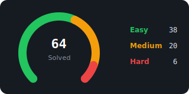

# LeetCode Solutions

**Grinding LeetCode in Java — one problem at a time.**

---

## Progress

---

## Solutions

🟢 Easy &nbsp;—&nbsp; <b>23 solved</b>

| # | Problem |
|---|---|
| 1 | [Two Sum](src/easy/%5B1%5DTwo%20Sum.java) |
| 9 | [Palindrome Number](src/easy/%5B9%5DPalindrome%20Number.java) |
| 13 | [Roman to Integer](src/easy/%5B13%5DRoman%20to%20Integer.java) |
| 14 | [Longest Common Prefix](src/easy/%5B14%5DLongest%20Common%20Prefix.java) |
| 20 | [Valid Parentheses](src/easy/%5B20%5DValid%20Parentheses.java) |
| 21 | [Merge Two Sorted Lists](src/easy/%5B21%5DMerge%20Two%20Sorted%20Lists.java) |
| 26 | [Remove Duplicates from Sorted Array](src/easy/%5B26%5DRemove%20Duplicates%20from%20Sorted%20Array.java) |
| 27 | [Remove Element](src/easy/%5B27%5DRemove%20Element.java) |
| 28 | [Find the Index of the First Occurrence in a String](src/easy/%5B28%5DFind%20the%20Index%20of%20the%20First%20Occurrence%20in%20a%20String.java) |
| 35 | [Search Insert Position](src/easy/%5B35%5DSearch%20Insert%20Position.java) |
| 66 | [Plus One](src/easy/%5B66%5DPlus%20One.java) |
| 67 | [Add Binary](src/easy/%5B67%5DAdd%20Binary.java) |
| 88 | [Merge Sorted Array](src/easy/%5B88%5DMerge%20Sorted%20Array.java) |
| 108 | [Convert Sorted Array to Binary Search Tree](src/easy/%5B108%5DConvert%20Sorted%20Array%20to%20Binary%20Search%20Tree.java) |
| 118 | [Pascal's Triangle](src/easy/%5B118%5DPascal's%20Triangle.java) |
| 119 | [Pascal's Triangle II](src/easy/%5B119%5DPascal's%20Triangle%20II.java) |
| 121 | [Best Time to Buy and Sell Stock](src/easy/%5B121%5DBest%20Time%20to%20Buy%20and%20Sell%20Stock.java) |
| 136 | [Single Number](src/easy/%5B136%5DSingle%20Number.java) |
| 169 | [Majority Element](src/easy/%5B169%5DMajority%20Element.java) |
| 217 | [Contains Duplicate](src/easy/%5B217%5DContains%20Duplicate.java) |
| 219 | [Contains Duplicate II](src/easy/%5B219%5DContains%20Duplicate%20II.java) |
| 222 | [Count Complete Tree Nodes](src/easy/%5B222%5DCount%20Complete%20Tree%20Nodes.java) |
| 228 | [Summary Ranges](src/easy/%5B228%5DSummary%20Ranges.java) |

🟡 Medium &nbsp;—&nbsp; <b>20 solved</b>

| # | Problem |
|---|---|
| 2 | [Add Two Numbers](src/medium/%5B2%5DAdd%20Two%20Numbers.java) |
| 3 | [Longest Substring Without Repeating Characters](src/medium/%5B3%5DLongest%20Substring%20Without%20Repeating%20Characters.java) |
| 5 | [Longest Palindromic Substring](src/medium/%5B5%5DLongest%20Palindromic%20Substring.java) |
| 6 | [Zigzag Conversion](src/medium/%5B6%5DZigzag%20Conversion.java) |
| 7 | [Reverse Integer](src/medium/%5B7%5DReverse%20Integer.java) |
| 8 | [String to Integer (atoi)](src/medium/%5B8%5DString%20to%20Integer%20(atoi).java) |
| 11 | [Container With Most Water](src/medium/%5B11%5DContainer%20With%20Most%20Water.java) |
| 12 | [Integer to Roman](src/medium/%5B12%5DInteger%20to%20Roman.java) |
| 15 | [3Sum](src/medium/%5B15%5D3Sum.java) |
| 16 | [3Sum Closest](src/medium/%5B16%5D3Sum%20Closest.java) |
| 17 | [Letter Combinations of a Phone Number](src/medium/%5B17%5DLetter%20Combinations%20of%20a%20Phone%20Number.java) |
| 18 | [4Sum](src/medium/%5B18%5D4Sum.java) |
| 19 | [Remove Nth Node From End of List](src/medium/%5B19%5DRemove%20Nth%20Node%20From%20End%20of%20List.java) |
| 22 | [Generate Parentheses](src/medium/%5B22%5DGenerate%20Parentheses.java) |
| 29 | [Divide Two Integers](src/medium/%5B29%5DDivide%20Two%20Integers.java) |
| 31 | [Next Permutation](src/medium/%5B31%5DNext%20Permutation.java) |
| 33 | [Search in Rotated Sorted Array](src/medium/%5B33%5DSearch%20in%20Rotated%20Sorted%20Array.java) |
| 34 | [Find First and Last Position of Element in Sorted Array](src/medium/%5B34%5DFind%20First%20and%20Last%20Position%20of%20Element%20in%20Sorted%20Array.java) |
| 53 | [Maximum Subarray](src/medium/%5B53%5DMaximum%20Subarray.java) |
| 120 | [Triangle](src/medium/%5B120%5DTriangle.java) |

🔴 Hard &nbsp;—&nbsp; <b>6 solved</b>

| # | Problem |
|---|---|
| 4 | [Median of Two Sorted Arrays](src/hard/%5B4%5DMedian%20of%20Two%20Sorted%20Arrays.java) |
| 10 | [Regular Expression Matching](src/hard/%5B10%5DRegular%20Expression%20Matching.java) |
| 23 | [Merge k Sorted Lists](src/hard/%5B23%5DMerge%20k%20Sorted%20Lists.java) |
| 25 | [Reverse Nodes in k-Group](src/hard/%5B25%5DReverse%20Nodes%20in%20k-Group.java) |
| 30 | [Substring with Concatenation of All Words](src/hard/%5B30%5DSubstring%20with%20Concatenation%20of%20All%20Words.java) |
| 32 | [Longest Valid Parentheses](src/hard/%5B32%5DLongest%20Valid%20Parentheses.java) |

---

Last updated: 2026-07-01 21:45 · Auto-generated by <a href="update-readme.sh">update-readme.sh</a>

